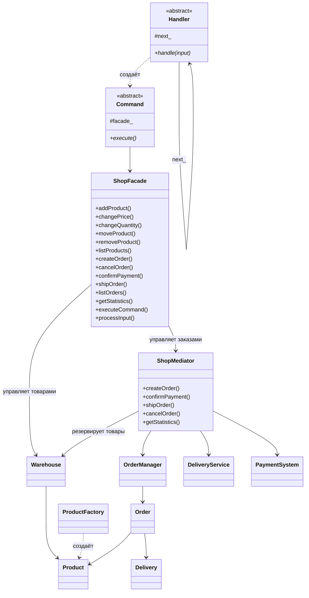

```mermaid
classDiagram
    class ShopFacade {
        +addProduct()
        +changePrice()
        +changeQuantity()
        +moveProduct()
        +removeProduct()
        +listProducts()
        +createOrder()
        +cancelOrder()
        +confirmPayment()
        +shipOrder()
        +listOrders()
        +getStatistics()
        +executeCommand()
        +processInput()
    }

    class Command {
        <<abstract>>
        #facade_
        +execute()*
    }

    class Handler {
        <<abstract>>
        #next_
        +handle(input)*
    }

    class ShopMediator {
        +createOrder()
        +confirmPayment()
        +shipOrder()
        +cancelOrder()
        +getStatistics()
    }

    class Warehouse
    class Product
    class ProductFactory
    class OrderManager
    class Order
    class DeliveryService
    class Delivery
    class PaymentSystem

    Command --> ShopFacade
    Handler --> Handler : next_
    Handler ..> Command : создаёт
    ShopFacade --> Warehouse : управляет товарами
    ShopFacade --> ShopMediator : управляет заказами
    ShopMediator --> Warehouse : резервирует товары
    ShopMediator --> OrderManager
    ShopMediator --> DeliveryService
    ShopMediator --> PaymentSystem
    Warehouse --> Product
    ProductFactory ..> Product : создаёт
    OrderManager --> Order
    Order --> Product
    Order --> Delivery
```
