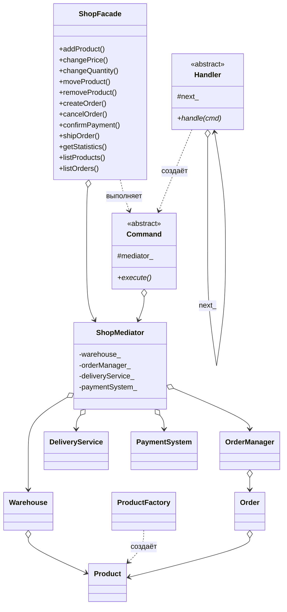

```mermaid
classDiagram
    class ShopFacade {
        +addProduct()
        +changePrice()
        +changeQuantity()
        +moveProduct()
        +removeProduct()
        +createOrder()
        +cancelOrder()
        +confirmPayment()
        +shipOrder()
        +getStatistics()
        +listProducts()
        +listOrders()
    }

    class ShopMediator {
        -warehouse_
        -orderManager_
        -deliveryService_
        -paymentSystem_
    }

    class Command {
        <<abstract>>
        #mediator_
        +execute()*
    }

    class Handler {
        <<abstract>>
        #next_
        +handle(cmd)*
    }

    class Warehouse
    class OrderManager
    class DeliveryService
    class PaymentSystem
    class Order
    class Product
    class ProductFactory

    ShopFacade o--> ShopMediator
    ShopFacade ..> Command : выполняет
    Handler o--> Handler : next_
    Handler ..> Command : создаёт
    Command o--> ShopMediator
    ShopMediator o--> Warehouse
    ShopMediator o--> OrderManager
    ShopMediator o--> DeliveryService
    ShopMediator o--> PaymentSystem
    Warehouse o--> Product
    ProductFactory ..> Product : создаёт
    OrderManager o--> Order
    Order o--> Product
```
